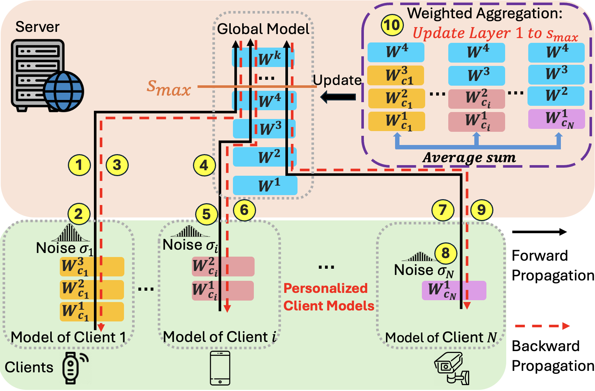

# P3SL: Personalized Privacy-Preserving Split Learning on Heterogeneous Edge Devices

This repository contains research code for **P3SL**, a personalized privacy-preserving split-learning framework for heterogeneous, resource-constrained edge devices.

<p align="center">
  
</p>

P3SL follows the paper design:

1. Clients train **sequentially** with the server instead of sharing models with one another.
2. Each client keeps a **personalized local model** at its own split point `s_i`.
3. Each client injects **personalized Laplacian activation noise** with level `sigma_i` before sending intermediate representations to the server.
4. Every `R` epochs, clients upload local parameters for **server-side weighted aggregation of `W_1:smax`**. The aggregated `W_1:smax` is kept on the server for evaluation and missing-layer filling; it is **not redistributed to clients in P3SL mode**.
5. Split-point and noise-level selection can be performed through the paper's table-based bi-level optimization: the server builds a privacy leakage table `PL(s, sigma)` and a noise assignment table `T_sigma[s]`, while clients choose split points using their local energy/power profile and privacy-sensitivity coefficient `alpha_i`.

---

## Repository layout

```text
P3SL/
├── DataOwner/                  Code that runs on each client device
│   ├── client_worker.py        Entry point for a data-owner client
│   ├── websocketServer.py      WebSocket worker and local training routines
│   ├── P3SLPrivacyOptimization.py  Client-side finite split enumeration
│   ├── Fsimmean.csv            Privacy leakage table copy for local lookup
│   ├── DataSet.py              Dataset loading and partitioning
│   ├── Dirichlet_Partition.py  Non-IID Dirichlet partitioner
│   ├── SplitPointProfiling.py  Energy/power profiling helpers
│   ├── CheckPowerConsumptionCode.py
│   └── PowerConsumptions.py
│
├── DataScientest/              Code that runs on the central server
│   ├── training_coordinator.py Entry point for P3SL orchestration
│   ├── Training.py             Sequential training, aggregation, reassignment
│   ├── P3SLPrivacyOptimization.py  PL/T_sigma and Eq. (3)/(5) helpers
│   ├── Fsimmean.csv            Default privacy leakage table
│   ├── Models.py               VGG and ResNet split-model wrappers
│   ├── Util.py                 Common utilities and evaluation helpers
│   ├── ParralelTraining.py     Baseline parallel training mode
│   └── websocketClient.py      Server-side proxy for each client
│
├── requirements.txt
├── LICENSE
└── README.md
```

---

## Installation

```bash
cd P3SL
python3 -m venv .venv
source .venv/bin/activate
pip install --upgrade pip
pip install -r requirements.txt
```

Core training uses PyTorch and WebSockets. Energy profiling depends on the hardware logger configured on the client devices, such as KASA or Jetson `jtop`.

---

## Energy profile required for automatic P3SL split selection

For `--p3sl_auto_config`, each client needs a local energy/power table. By default the client looks for:

```text
DataOwner/EnergyCsv/<client_worker_name>.csv
```

The table should include:

```csv
Split Layer,Total,PeakPower
1,903.0,4311
2,951.0,4331
...
10,633.0,6297
```

Accepted alternatives include `SplitLayer` instead of `Split Layer`, `Energy` instead of `Total`, and `MaxEnergy`/`MaxPower`/`p_peak` instead of `PeakPower`.

---

## Quick start: paper-aligned P3SL mode

### 1. Launch one client worker on each device

Run this from `P3SL/DataOwner` on every data-owner device. Choose the privacy sensitivity `alpha_i` locally.

```bash
python3 client_worker.py \
  --name Client1 \
  --host 0.0.0.0 \
  --port 8777 \
  --dataset cifar10 \
  --iid 0 \
  --privacy_alpha 0.4
```

Repeat for every client, changing `--name`, `--port`, and `--privacy_alpha` as needed.

### 2. Launch the server-side training coordinator

Run this from `P3SL/DataScientest` after all clients are listening:

```bash
python3 training_coordinator.py \
  --dataset cifar10 \
  --modelName VGG16bn \
  --hosts 192.168.1.10 192.168.1.11 192.168.1.12 \
  --ports 8777 8777 8777 \
  --epoches 200 \
  --batch_size 256 \
  --lr 0.01 \
  --optimizer SGD \
  --mode P3SL \
  --p3sl_auto_config \
  --p3sl_smax 10 \
  --p3sl_fsim_threshold 0.36 \
  --aggrigate_evaluation \
  --aggrigate_eval_per_epoch 5
```

With `--p3sl_auto_config`, the coordinator builds `T_sigma[s]` from `Fsimmean.csv`, sends the privacy table and noise table to clients, and each client chooses its own split point using its local energy/power profile. The coordinator then sets the selected `s_i` and `sigma_i` values before training.

To enable the paper's noise reassignment rule, provide either a direct `A_min` or a no-noise reference accuracy:

```bash
--p3sl_min_accuracy 0.90
```

or

```bash
--p3sl_reference_accuracy 0.95 --p3sl_accuracy_discount 0.05
```

When the aggregated held-out accuracy is below `A_min`, the coordinator applies:

```text
sigma_{t+1} = sigma_t * (1 - 2 * (A_min - A_t))
```

and asks clients to re-run local split selection.

---

## Manual split/noise mode

You can still reproduce fixed-configuration experiments by directly supplying split points and noise levels:

```bash
python3 training_coordinator.py \
  --dataset cifar10 \
  --modelName VGG16bn \
  --hosts 192.168.1.10 192.168.1.11 \
  --ports 8777 8777 \
  --mode P3SL \
  --sl 2 10 \
  --dpNoise 1.65 0.02 \
  --epoches 200 \
  --batch_size 256
```

`--dpNoise` is a legacy flag name in the code. In P3SL it represents the activation-noise level `sigma`; for Laplacian noise, the code sets the PyTorch Laplace scale so that the injected noise has variance `sigma^2`.

---

## Important P3SL behavior

- P3SL mode does **not** redistribute the aggregated client-side model to clients. This preserves personalized client models.
- `--uploadaggrigate` is retained for baselines, but it is ignored in `--mode P3SL`.
- The aggregation function now averages over the participating clients only and fills missing layers `s_i+1:smax` with current server-side weights, matching Eq. (1) in the paper.
- The client split-selection objective is now `alpha_i * FSIM(s_i, sigma_i) + (1 - alpha_i) * E_i_total(s_i)`, so larger `alpha_i` prioritizes privacy and smaller `alpha_i` prioritizes energy.

---

## Outputs

Typical outputs are written to:

```text
Results/                 Training/evaluation CSVs
Results/SPProfiling/     Split-point energy profiles
Models/                  Model checkpoints
CSV/                     Temporary client/server logs
CSV/KASALOGS/            KASA power logs
```

These runtime artifacts are ignored by Git.
